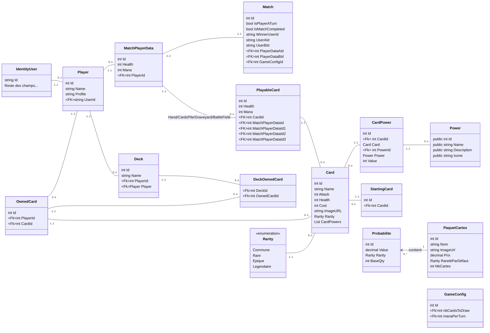

# Super Cartes Infinies

## Diagramme

```mermaid
classDiagram
    direction RL
    Player "0..1" -- "1..1" IdentityUser
    MatchPlayerData "0..n" -- "1..1" Player
    Match "1..1" -- "2..2" MatchPlayerData
   
    PlayableCard "0..n" -- "1..1" MatchPlayerData : Hand/CardsPile/Graveyard/BattleField
    Card "0..n"  -- "1..1" PlayableCard
    Player "1..1" -- "0..n" OwnedCard
    Card "0..1" -- "1..1" OwnedCard
    Deck "0..n" -- "1..1" Player
    DeckOwnedCard "0..n" -- "1..1" Deck
    DeckOwnedCard "0..n" -- "1..1" OwnedCard
    Power "0..n" -- "1..1" CardPower
    CardPower "1..1" -- "0..n" Card
    StartingCard "1..1" -- "0..n" Card
    Card "0..n" -- "1..1" Rarity
    PaquetCartes "1" --> "0..*" Probabilite : contient
    class IdentityUser{
      string Id
      Reste des champs...
    }

    class Player{
      int Id
      string Name
      string Profile
      &lt;FK&gt;string UserId
    }

    class Match{
      int Id
      bool IsPlayerATurn
      bool IsMatchCompleted
      string WinnerUserId
      string UserAId
      string UserBId
      &lt;FK&gt;int PlayerDataAId
      &lt;FK&gt;int PlayerDataBId
      &lt;Fk&gt;int GameConfigId
    }

    class MatchPlayerData{
      int Id
      int Health
      int Mana
      &lt;FK&gt;int PlayerId
    }

    class PlayableCard{
      int Id
      int Health
      int Mana
      &lt;FK&gt;int CardId
      &lt;FK&gt;int MatchPlayerDataId
      &lt;FK&gt;int MatchPlayerDataId1
      &lt;FK&gt;int MatchPlayerDataId2
      &lt;FK&gt;int MatchPlayerDataId3
    }

    class Card{
      int Id
      string Name
      int Attack
      int Health
      int Cost
      string ImageURL
      Rarity Rarity
      List<CardPower> CardPowers
    }
 class PaquetCartes {
      int Id
      string Nom
      string ImageUrl
      decimal Prix
      Rarity RaretéParDéfaut
      int NbCartes
    }


    class Probabilite {
      int Id
      decimal Value
      Rarity Rarity
      int BaseQty
    }
  
    class Rarity{
      <<enumeration>>
      Commune
      Rare
      Epique
      Legendaire
    }
    class OwnedCard{
      int Id
      &lt;Fk&gt;int PlayerId
      &lt;Fk&gt;int CardId
    }

    class GameConfig{
      int Id
      &lt;Fk&gt;int nbCardsToDraw
      &lt;Fk&gt;int manaPerTurn 
    }

    class StartingCard{
      int Id
      &lt;Fk&gt;int CardId
    }

    class Deck{
      int Id
      string Name
      &lt;Fk&gt;int PlayerId
      &lt;Fk&gt;Player Player
    }

    class Power {
        
        public int Id 

        public string Name 

        public string Description 

        public string Icone 
    }

  class CardPower {
         int Id 

        &lt;Fk&gt; int CardId 

          Card Card 

        &lt;Fk&gt; int PowerId 

          Power Power 

         int Value 
    }
    class DeckOwnedCard{
      &lt;Fk&gt;int DeckId
      &lt;Fk&gt;int OwnedCardId 
    }

```
